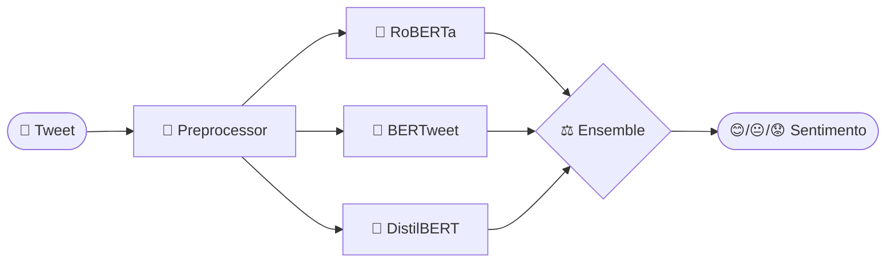

# 🧠 Sentiment Ensemble — Twitter NLP


> Ensemble de modelos transformer para análise de sentimento em tweets,
> combinando RoBERTa-Twitter, BERTweet e DistilBERT via soft voting ponderado.

## 🎯 O que é este projeto?

Este é um projeto de **Análise de Sentimento em Tweets** desenvolvido como trabalho final da disciplina Python em Projetos de IA.

O sistema classifica tweets em três categorias:
- 😊 **Positivo**
- 😐 **Neutro**
- 😟 **Negativo**

## 🏗️ Arquitetura



**Fluxo do Pipeline:**

1. **Entrada** → Tweet de texto
2. **Preprocessing** → Limpeza (URLs, menções, hashtags)
3. **3 Modelos** → Predição paralela
4. **Ensemble** → Weighted soft voting
5. **Saída** → Sentimento final

**3 Modelos Combinados:**
1. **RoBERTa Twitter** (125M) — Treinado em 58M tweets
2. **BERTweet** (110M) — Pré-treinado em 850M tweets
3. **DistilBERT** (66M) — Leve e rápido

**Resultado Esperado:** F1-Macro ~0.77

## 🚀 Quick Start

### 1. Clone o projeto
```bash
git clone https://github.com/cavalcanteprofissional/tweet-sentiment-analysis.git
cd tweet-sentiment-analysis
```

### 2. Instale as dependências
```bash
pip install -r requirements.txt
```

### 3. Rode a interface Streamlit
```bash
streamlit run app/main.py
```

Acesse: http://localhost:8501

## 📱 Interface

A interface Streamlit permite:
- Entrar com qualquer tweet
- Ver o sentimento predito
- Conferir a confiança daprediction
- Analisar scores de cada modelo

## 📂 Estrutura do Projeto

```
tweet-sentiment-analysis/
├── src/                    # Código principal
│   ├── data_loader.py      # Carregamento do dataset
│   ├── preprocessor.py   # Limpeza de tweets
│   ├── models.py        # Pipelines dos modelos
│   ├── ensemble.py    # Weighted soft voting
│   └── evaluate.py    # Métricas
├── app/
│   └── main.py          # Interface Streamlit
├── scripts/
│   ├── run_inference.py  # CLI para inferência
│   └── push_to_hub.py # Publicar no HF Hub
├── notebooks/
│   ├── 01_EDA.ipynb
│   ├── 02_baseline.ipynb
│   └── 03_ensemble.ipynb
└── tests/
    └── test_preprocessor.py
```

## 📊 Dataset

- **TweetEval** (cardiffnlp/tweet_eval)
- Train: 45.615 tweets
- Validation: 2.000 tweets
- Test: 12.284 tweets

## 🤖 Executar Scripts

### Inferência via CLI
```bash
python scripts/run_inference.py "I love this product!"
```

### Publicar no HuggingFace Hub
```bash
python scripts/push_to_hub.py seu-usuario/sentiment-ensemble
```
*(requer HF_TOKEN no .env)*

## ⚙️ Dependências

```
transformers>=4.40.0
datasets>=2.19.0
torch>=2.3.0
scikit-learn>=1.4.2
pandas>=2.2.2
matplotlib>=3.8.4
seaborn>=0.13.2
huggingface-hub>=0.23.0
tqdm>=4.66.4
streamlit>=1.36.0
```

## 🔧 Testes

```bash
pytest tests/
```

## 📝 Equipe

| Nome | Email |
|------|-------|
| George Lucas Lopes da Silva Gomes | |
| Lucas Cavalcante dos Santos | cavalcantesidi@outlook.com |
| Raylson Silva de Lima | raylson.ifce@gmail.com |
| Sthefferson Bruno Costa Ferreira | sthefferson.ufma@gmail.com |

## 📚 Licença

MIT License